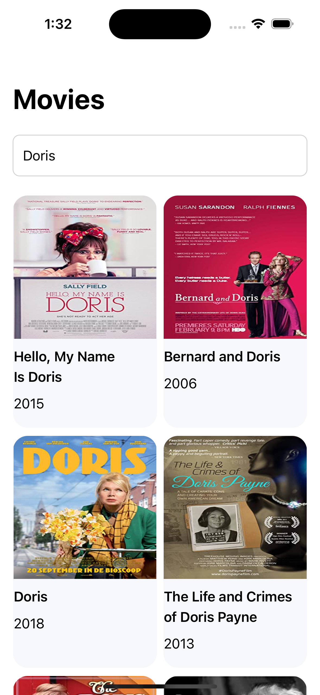
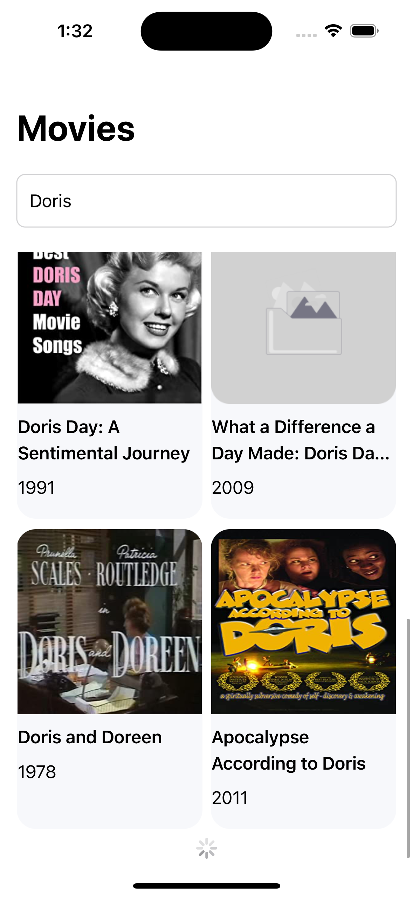

# Movie App

Searhing result                |  Load more                     |  No results
:-----------------------------:|:------------------------------:|:-------------------------:
 |   |  

iOS Movie application using SwiftUI and OMDb data to display movies based on user's searching keyword. 

## Functions
* User can enter the movie title to search for.
* The movie list items will be fetchd by from The Open Movie Database API.
* When the user reaches the end of the screen, the load more will be triggered if there are remaining data.

## Projects structure, technologies and methodologies
* MVVM as base structure, discerning file using the feature-first appoach.
* SwiftUI for UI building.
* Reactive programing with Combine framework.

## Future Improvements:
* Adding Units Test ViewModels and Utilities classes
* Adding appropriate comments/descriptions to classes and methods
* Improve movie item UI and error state UI
